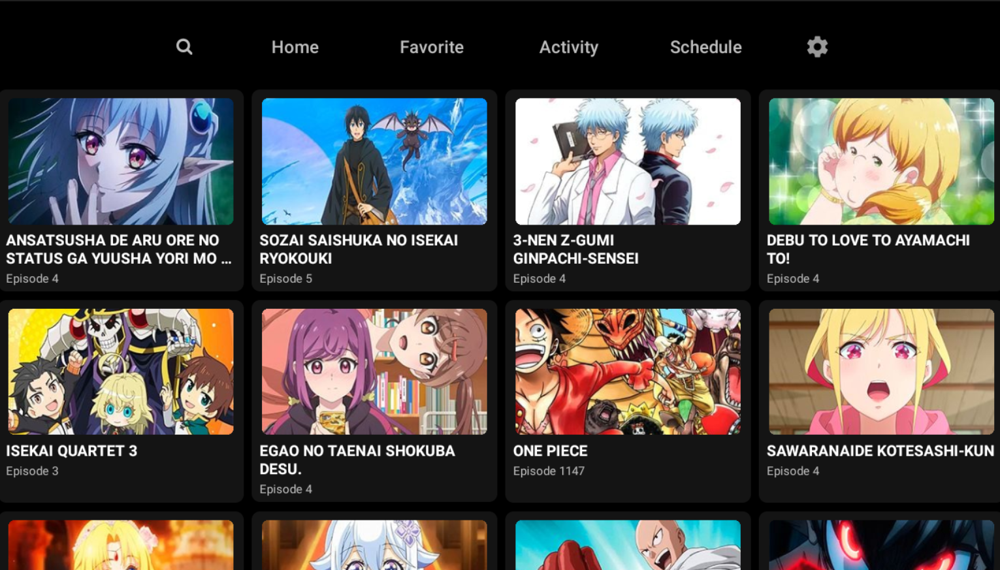
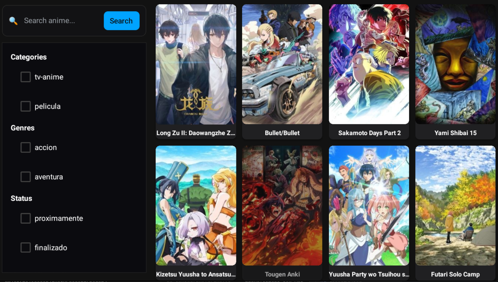
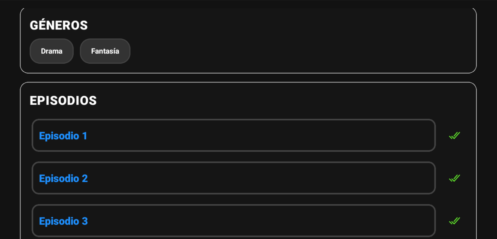
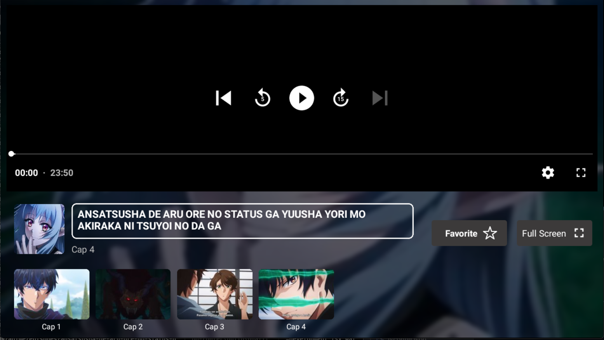
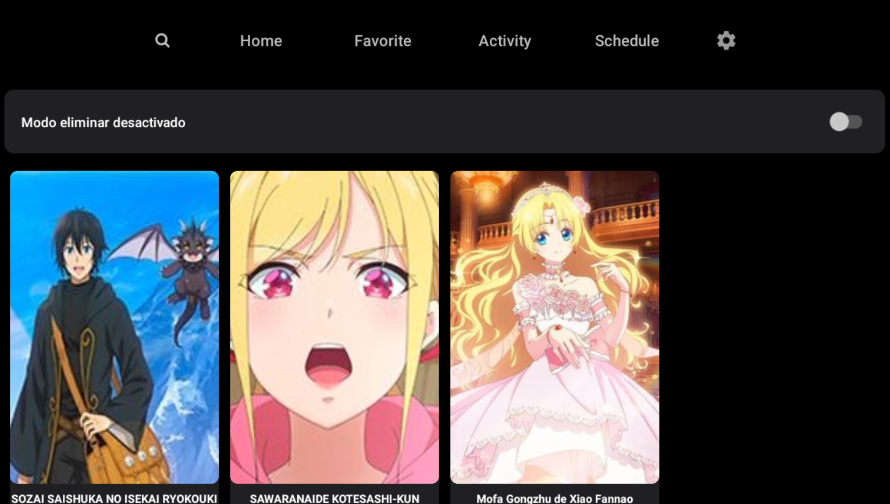
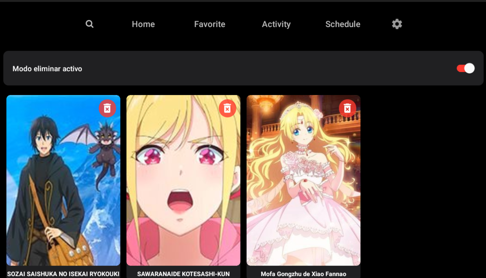
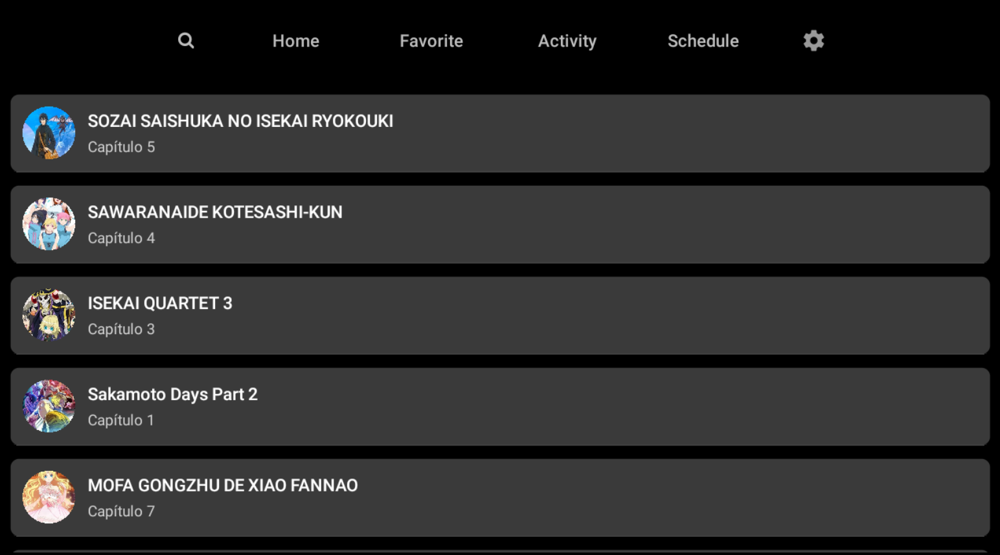
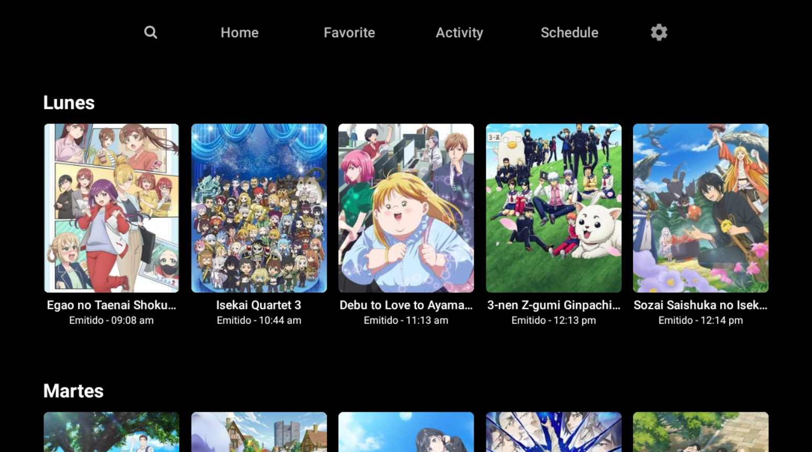

# AniFrame (Android TV + Web)

AniFrame es una app de streaming centrada en TV (Android TV / Apple TV) construida con Expo Router, React Native TV fork y navegación con DPAD. Incluye exploración con filtros avanzados, favoritos estilo Netflix, historial de actividad, horario semanal y reproducción con persistencia de progreso.

## Capturas de pantalla

| Home | Explorer | Detalle (top) | Detalle (middle) |
|---|---|---|---|
|  |  |  |  |

| Video | Favoritos | Favoritos (borrar) | Historial |
|---|---|---|---|
|  |  |  |  |

| Horario |
|---|
|  |

## Características

- Navegación TV-first con DPAD: foco estable, carouseles y grillas TV-friendly.
- Búsqueda con filtros (query, género, categoría, estado) y URL compartible.
- Favoritos estilo Netflix con tarjetas enfocables y feedback visual.
- Historial de actividad y progreso de video persistente.
- Horario semanal con navegación vertical/horizontal controlada.
- Web de acompañamiento (Expo Web) para escritorio.

## Arquitectura

- Expo + Expo Router (file-based routing)
- React Native TV fork (tvos) + plugin `@react-native-tvos/config-tv`
- FlashList (listas performantes)
- Manejo de foco en TV (Android TV) con nextFocus y trampas de foco
- Contexto `AppConfigContext` para `apiBaseUrl` del backend

## Requisitos

- Node.js 18+
- Yarn (o npm/pnpm equivalente)
- Bun (para el servidor)
- pnpm (para compilar el SDK)

## Levantar el cliente (TV/Web)

```pwsh
# Instalar dependencias
yarn

# TV: prebuild con modificaciones de TV (o define expo.extra.isTV)
$env:EXPO_TV = "1"
yarn prebuild:tv

# Android TV (emulador/dispositivo)
yarn android

# Apple TV (en macOS)
yarn ios

# Web (localhost)
yarn web
```

Notas:
- También puedes habilitar TV en `app.json` (`expo.extra.isTV: true`).
- Usa la misma red LAN entre dispositivo y PC para desarrollo.

## Configurar el backend en la app

La app lee y persiste `apiBaseUrl` mediante `AppConfigContext` (AsyncStorage). Para apuntar al servidor Bun:
- Abre la pestaña Settings en la app (icono ⚙️) y establece la URL base (p. ej. `http://192.168.1.50:3000`).
- La app usará esa URL para todas las llamadas (`useFetch`, historial, búsqueda, etc.).

## Backend: Bun + SDK por Socket (socket.io)

Repositorios:
- Servidor (Bun/Elysia + socket.io-client): https://github.com/franciscorojas27/AniFrame_Server
- SDK (lanza un servidor socket.io y expone eventos): https://github.com/franciscorojas27/AniFrame_SDK

Flujo de alto nivel:
1) El SDK arranca un servidor socket.io en un puerto dinámico y escribe `%TEMP%/animeav1/config.json` con `{ port, pid }`.
2) El servidor Bun (AniFrame_Server) se conecta como cliente (`socket.io-client`) a `SOCKET_IO_URL + port` y expone HTTP REST a la app móvil/web. Las llamadas HTTP internas usan `sendMessage(event, payload)` sobre el socket.
3) La app consume únicamente HTTP del servidor Bun. No se conecta por socket desde el cliente.

### 1) Construir/ejecutar el SDK (inicia el socket server)

```pwsh
# En AniFrame_SDK
pnpm install
pnpm build
# Ejecutar el build para levantar el socket server (crea %TEMP%/animeav1/config.json)
node .\dist\index.js
```

Eventos soportados por el socket del SDK (nombres aprox. según código):
- "getHomePageListAnime"
- "getSearchAnime"  (args: { query, page, genres: string[], status, category })
- "getCatalogListAnime" (args: { page, genres, status, category })
- "getEpisodeList" (args: { slug })
- "getAnimeDetails" (args: { slug })
- "getAnimeSchedule"
- "getAnimeStreamingLinks" (args: { url: string[], delay?: number })
- "getManifest"

El servidor del SDK utiliza callbacks de socket: `socket.on(event, async (data, callback) => callback({ success, content|error }))`.

### 2) Servidor Bun: conectarse al SDK por socket y exponer HTTP

En AniFrame_Server (`src/main.ts`) se establece la conexión y se exporta `sendMessage`:

```ts
import { io } from 'socket.io-client'
import os from 'node:os'
import fs from 'node:fs'
import path from 'node:path'

const pathPluginPort = path.join(os.tmpdir(), 'animeav1', 'config.json')
const config = JSON.parse(fs.readFileSync(pathPluginPort, 'utf-8'))
const socket = io(process.env.SOCKET_IO_URL + config.port)

export const sendMessage = async (command: string, message: object) => {
	return new Promise((resolve) => {
		socket.emit(command, message, (response: any) => resolve(response))
	})
}
```

Ejemplo de un handler HTTP en Elysia que usa `sendMessage`:

```ts
import { Elysia } from 'elysia'
import { sendMessage } from './main'

new Elysia({ prefix: '/api' })
	.get('/home', async () => await sendMessage('getHomePageListAnime', {}))
	.get('/search', async ({ query }) => {
		const { q = '', page = '1', genre = '', category = '', status = '' } = query as Record<string, string>
		const genres = genre ? genre.split(',').filter(Boolean) : []
		return await sendMessage('getSearchAnime', {
			args: { query: q, page: Number(page), genres, status, category }
		})
	})
	.listen(3000)
```

### 3) Ejecutar el servidor Bun

```pwsh
# En AniFrame_Server
bun install
bun run dev
```

### 4) Probar desde la app
- En Settings, apunta `apiBaseUrl` a `http://TU_IP:3000`
- Abre Explorer y usa filtros/búsqueda; revisa la consola de AniFrame_Server y el proceso del SDK.

## Builds y distribución

- EAS (recomendado):
```pwsh
npx eas-cli build
```
- Local Android (gradle): revisa `android/app/build/outputs/...` para APK/AAB.
- Puedes usar el build incluido en este repo si está disponible en Releases o carpeta de outputs.

## TV/UX: buenas prácticas

- Mantén foco visible y predecible; trapea los extremos con nextFocus.
- Evita hooks dentro de renderItem; usa memo y extraData en listas.
- Para filtros, dedupe y sanitiza arrays antes de enviar a backend.

## Estructura del proyecto

- `app/` rutas (Expo Router)
- `components/` UI compartida (checkbox TV-safe, grillas)
- `contexts/` `AppConfigContext` (`apiBaseUrl`)
- `hooks/` fetch/progreso/TV focus
- `layouts/` navegación/tab (web/tv)
- `screenshots/` capturas usadas en este README

## Problemas comunes

- 404/500: verifica `apiBaseUrl` y conectividad LAN (usa IP, no localhost en TV).
- CORS en Web: habilita cabeceras en Elysia.
- TLS: usa http en LAN; para prod, proxy con certificado.
- Socket no responde: asegúrate de haber arrancado el SDK (`node dist/index.js`) y que `%TEMP%/animeav1/config.json` existe con un `port` válido. El servidor Bun debe leer este archivo y concatenar con `SOCKET_IO_URL`.
- Firewall/puerto: abre el puerto del socket y el del servidor Bun. En Windows, permite el proceso en el firewall.

## Licencia

Consulta las licencias en AniFrame_Server y AniFrame_SDK.
